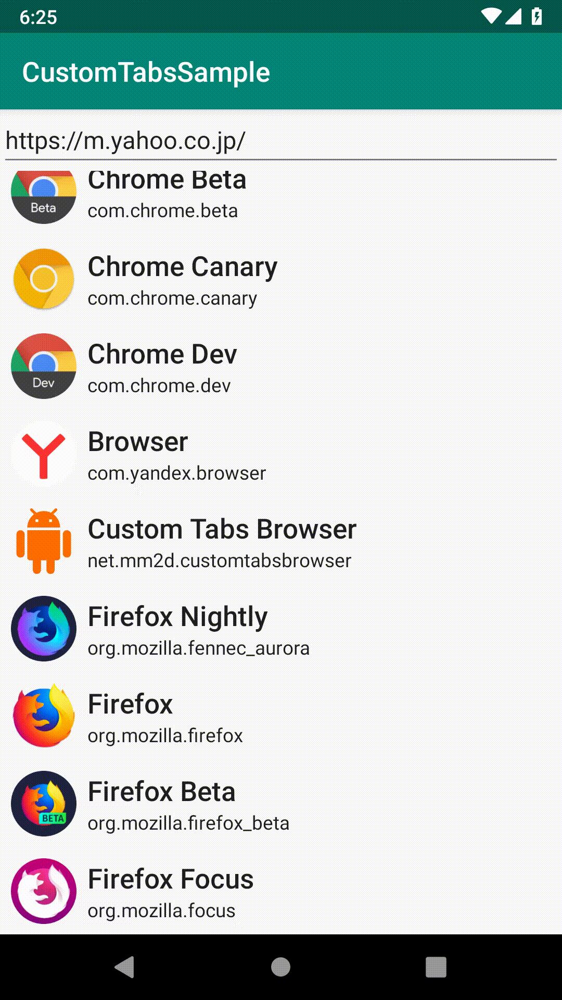

# Custom Tabs Browser Sample

A sample implementation for browser that support Chrome Custom Tabs.

|||
|-|-|

## Implementation status

- Intent
  - :white_check_mark: launchUrl
  - :white_check_mark: setShowTitle
  - :white_check_mark: setToolbarColor
  - enableUrlBarHiding
  - :white_check_mark: addDefaultShareMenuItem
  - :white_check_mark: addMenuItem
  - :white_check_mark: setActuionButton
    - :white_check_mark: shouldTint
  - :white_check_mark: addToolbarItm
  - :white_check_mark: setCloseButtonIcon
  - :white_check_mark: setSecondaryToolbarColor
  - :white_check_mark: setStartAnimations
  - :white_check_mark: setExitAnimations
  - setSecondaryToolbarViews
  - setInstantAppsEnabled
- Service
  - :white_check_mark: bind/unbind
  - warmup
  - newSession
  - :white_check_mark: onNavigationEvent
  - extraCallback
  - onRelationshipValidationResult
  - onMessageChannelReady
  - onPostMessage
  - mayLaunchUrl

## Author
大前 良介 (OHMAE Ryosuke)
http://www.mm2d.net/

## License
[MIT License](./LICENSE)
